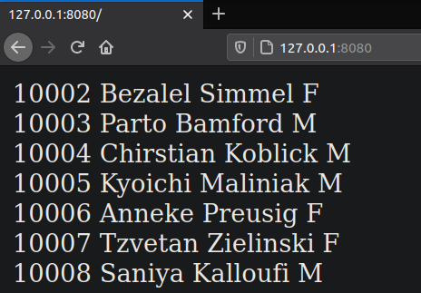
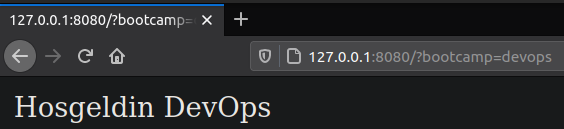

# Trendyol System Bootcamp Mezuniyet Projesi 

## Case 1

## Case 2

### Prerequisite
For the next section, Ansible, Vagrant and a Virtual Machine suitable for Vagrant must be preinstalled (I used Oracle VM VirtualBox, but since Vagrant is used, the choice of the virtual machine should not be important).

### Run
It only takes one command to run. From the devops/Nisan19 folder:
```
vagrant up
```

### What happens at a startup?
First, Vagrant launches a virtual machine called app. As an image I used Ubuntu 20.04 LTS (Focal Fossa) here I should note that using other images most likely will not work. It has to do with how I wrote the roles. Even though I knew about Ansible Galaxy for my first project including Ansible, I wanted to write a lot of things myself.

I also configured port forwarding in the Vagrantfile so that we have access to the guest port 80 through the host port 8080.

Next, Vagrant provides playbook.yml, and we move on to Ansible. For ansible, I have created 3 roles pip, docker and nginx which are executed in this order.

The pip role performs only one operation, namely the installation of pip.

The Docker role installs Docker as well as Docker and Docker Compose as pip packages that Ansible requires. Then it runs docker-compose on the docker-compose.yml file.

Docker Compose builds my image from the Dockerfile and runs two instances each on a different port.

My application is a very simple Flask application. Therefore, I used python: 3.9.2-buster as the base of the image. After that, the files main.py requirements.txt employee.db are copied there, and the dependencies from the requirements.txt file are installed.

The role of NGINX does two things: installation and configuration. The installation is almost identical to that of Docker.

NGINX's configuration is done simply by copying the load-balancer.conf file to /etc/nginx/conf.d/default.conf. Load balancer is configured for two Docker containers.

### Examples of work

Since the DB was required, the root entry point simply prints a list of 20 employees. I used SQLAlchemy for this.



An example of working with bootcamp = devops:

