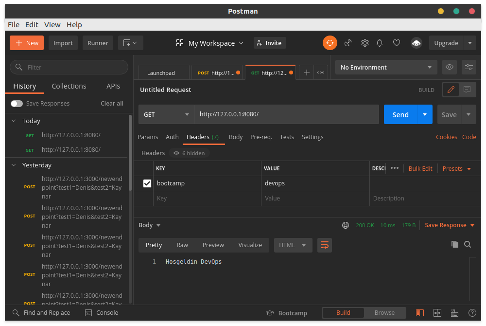

# Trendyol System Bootcamp Mezuniyet Projesi

## Case 1

I will perform all operations as a non-root user.

To create a new user you need to use:

```
sudo adduser denis.kaynar
```

Then you need to choose a password for the user.

```
sudo passwd denis.kaynar
```

Also, to allow the user to use sudo, he must be added to the wheel group:

```
usermod -aG wheel denis.kaynar
```

Then I changed the user using su:

```
su denis.kaynar
```

In order to mount our disk, we need to know its device name. A list of device names of installed disks in the system can
be found using the fdisk command.

```
sudo fdisk -l
```

The result of this command:

```
Disk /dev/sda: 8589 MB, 8589934592 bytes, 16777216 sectors
Units = sectors of 1 * 512 = 512 bytes
Sector size (logical/physical): 512 bytes / 512 bytes
I/O size (minimum/optimal): 512 bytes / 512 bytes
Disk label type: dos
Disk identifier: 0x000eb1f8

   Device Boot      Start         End      Blocks   Id  System
/dev/sda1   *        2048     2099199     1048576   83  Linux
/dev/sda2         2099200    16777215     7339008   8e  Linux LVM

Disk /dev/sdb: 10.7 GB, 10737418240 bytes, 20971520 sectors
Units = sectors of 1 * 512 = 512 bytes
Sector size (logical/physical): 512 bytes / 512 bytes
I/O size (minimum/optimal): 512 bytes / 512 bytes
```

Here we find our 10 GB disk and remember its device name. In my case, this is /dev/sdb.

The disk does not have a partition table. First you need to create it, I will again use the fdisk command.

```
sudo fdisk /dev/sdb
```

Thus, we get to the fdisk menu

First, we need to create a new partition table. From the available types, I chose MBR. To do this, press o and enter


Now you can add a new section. To do this, press n press and enter three times agreeing with the default values.


And we write all the changes to disk with the w button.

Now we need to create a file table, I chose the ext4 file system. For this I will use the mkfs.ext4 command. Since the
device name we had was /dev/sdb and the partition number we gave 1, the name of the partition we needed turned out to be
/dev/sdb1. Command for this operation:

```
sudo mkfs.ext4 /dev/sbd1
```

We need to create a folder where we will mount the disk:

```
sudo mkdir /bootcamp
```

Now we can mount our partition for this I will use the mount command

```
sudo mount /dev/sdb1 /bootcamp
```

And the folder where the file will be located

```
sudo mkdir /opt/bootcamp
```

Now we can create a file and write "merhaba trendyol" there.

```
sudo sh -c 'echo "merhaba trendyol" > /opt/bootcamp/bootcamp.txt' 
```

And since I need to combine the two commands, I did it like this:

```
find / -name 'bootcamp.txt' -exec mv -t /bootcamp {} +
```

Final result:


## Case 2

### Prerequisite

For the next section, Ansible, Vagrant and a Virtual Machine suitable for Vagrant must be preinstalled (I used Oracle VM
VirtualBox, but since Vagrant is used, the choice of the virtual machine should not be important).

### Run

It only takes one command to run. From the devops/Nisan19 folder:

```
vagrant up
```

### What happens at a startup?

First, Vagrant launches a virtual machine called app. As an image I used Ubuntu 20.04 LTS (Focal Fossa) here I should
note that using other images most likely will not work. It has to do with how I wrote the roles. Even though I knew
about Ansible Galaxy for my first project including Ansible, I wanted to write a lot of things myself.

I also configured port forwarding in the Vagrantfile so that we have access to the guest port 80 through the host port

8080.

Next, Vagrant provides playbook.yml, and we move on to Ansible. For ansible, I have created 3 roles pip, docker and
nginx which are executed in this order.

The pip role performs only one operation, namely the installation of pip.

The Docker role installs Docker as well as Docker and Docker Compose as pip packages that Ansible requires. Then it runs
docker-compose on the docker-compose.yml file.

Docker Compose builds my image from the Dockerfile and runs two instances each on a different port.

My application is a very simple Flask application. Therefore, I used python: 3.9.2-buster as the base of the image.
After that, the files main.py requirements.txt employee.db are copied there, and the dependencies from the
requirements.txt file are installed.

The role of NGINX does two things: installation and configuration. The installation is almost identical to that of
Docker.

NGINX's configuration is done simply by copying the load-balancer.conf file to /etc/nginx/conf.d/default.conf. Load
balancer is configured for two Docker containers.

### Examples of work

Since the DB was required, the root entry point simply prints a list of 20 employees. I used SQLAlchemy for this.


An example of working with bootcamp = devops:


